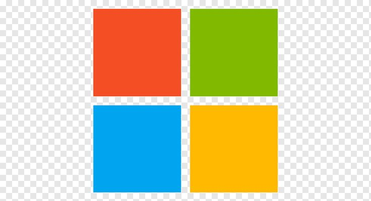

# MSSA Cloud Application Developer – Learning Portfolio


Welcome to my learning portfolio! This repository tracks my journey through the Microsoft Software and Systems Academy (MSSA) Cloud Application Developer program. Here, you'll find daily updates, code samples, demos, and class projects—showcasing my progress and offering resources for others who want to learn along the way.

---

## Purpose

- **Track Progress:** Daily commits show my growth and learning throughout the MSSA program.
- **Share Learning:** Code samples, notes, and explanations to help fellow students or anyone interested in cloud development.
- **Showcase Projects:** A home for demos and class projects built as part of the curriculum.

---

## File Structure

```plaintext
.
├── AAA/           # Daily Demo Environment
├── Demos/         # In-Class Demos and Example Code
├── Projects/      # Projects assigned in Class
├── .DS_Store      # System file, safe to ignore
├── .gitignore     # Git configuration file
└── README.md      # This file!
```

---

## Projects

The `Projects` folder contains assignments and projects built during the MSSA program.

**Explore my projects:**  
[Projects Directory](https://github.com/FreddyJ01/MSSA/tree/main/Projects)

---

## Demos

The `Demos` folder features daily code samples and in-class exercises. These are designed to reinforce concepts taught each day and may include:

**Check out the demos:**  
[Demos Directory](https://github.com/FreddyJ01/MSSA/tree/main/Demos)

---

## How to Use This Repo

- **Browse folders** for projects and demos to see my daily progress.
- **Reference code** and notes for your own learning—everything here is open and meant to help others!
- **Suggestions and contributions** are welcome. Open an issue or pull request if you have ideas or improvements.

---

## Daily Updates

I update this repository every day with new demos, code samples, and project work. Come back often to track my journey and see what I've learned!

---

## License

This repository is open for educational purposes. Feel free to use or reference any code or notes here.

---